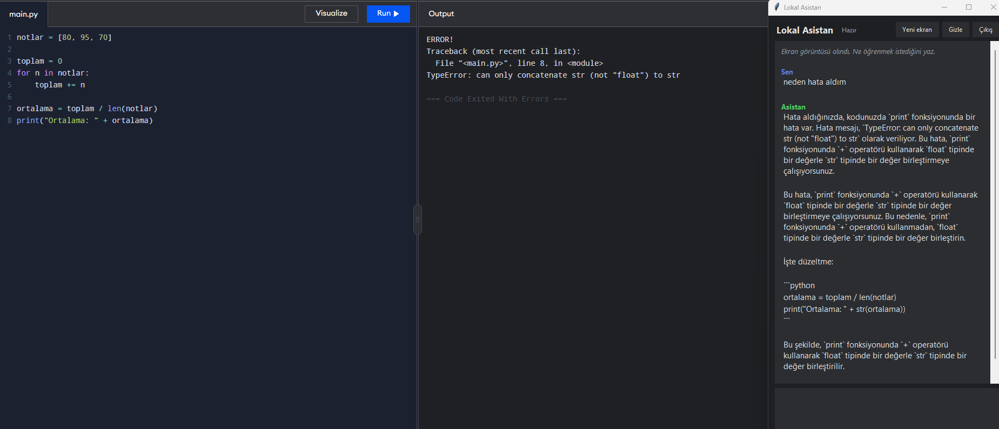
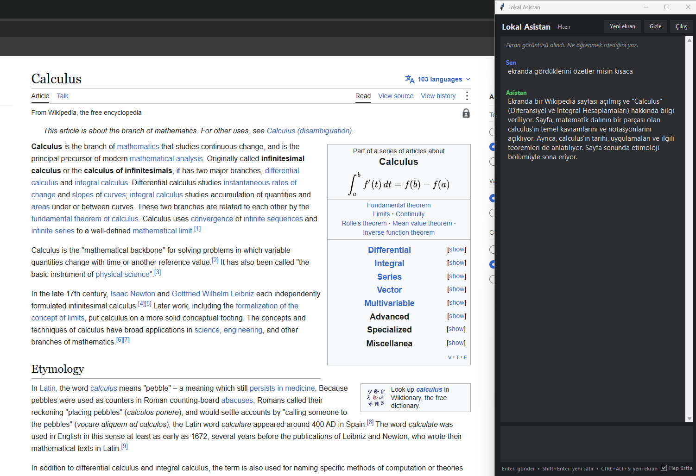

# Lokal Asistan

Bilgisayarında tamamen yerelde çalışan, ekranını görebilen bir yapay zeka asistanı. Bir kısayol tuşuna basıyorsun, ekran görüntüsü alınıyor ve yan tarafta bir sohbet penceresi açılıyor. Ekranla ilgili istediğini soruyorsun ("bu hatayı nasıl çözerim?", "bunu nasıl yaparım?"), asistan görüntüye bakarak cevap veriyor.

Model [Ollama](https://ollama.com) üzerinden yerelde çalışır. Ekran görüntüleri ve konuşmalar bilgisayarından dışarı çıkmaz, API ücreti ya da kullanım limiti yoktur.

<!-- Demo GIF'i eklediğinde bu satırın başındaki ve sonundaki işaretleri silip dosya adını düzelt:

-->

## Ekran görüntüleri




## Özellikler

- `Ctrl + Alt + S` ile ana monitörün ekran görüntüsünü alma (pencere görüntüye girmemesi için kısa süre gizlenir)
- Ekranın sağ kenarına yaslanan koyu temalı sohbet penceresi
- Cevapların yazıldıkça akması (streaming)
- Aynı ekran hakkında devam eden sorular (sohbet geçmişi modele gönderilir)
- Ekran görüntüsü modele gönderilmeden önce küçültülür (Pillow kuruluysa), böylece cevaplar hızlanır
- "Hep üstte" seçeneği, `Enter` ile gönderme, `Shift + Enter` ile yeni satır

## Nasıl çalışıyor?

1. `keyboard` kütüphanesi kısayol tuşunu arka planda dinler.
2. Tuşa basılınca pencere gizlenir, `mss` ile ekran yakalanır ve `ekran.png` olarak kaydedilir.
3. Kullanıcı soruyu yazınca ekran görüntüsü ilk soruyla birlikte, görüntü destekli bir modele (Qwen2.5-VL) Ollama'nın Python kütüphanesi üzerinden gönderilir.
4. Cevap, ayrı bir thread'de parça parça alınır ve bir kuyruk (`queue`) aracılığıyla Tkinter arayüzüne aktarılır. Arayüz sadece ana thread'den güncellendiği için bu ayrım gerekir.

## Kurulum

Gereksinimler: Windows, Python 3.10+, [Ollama](https://ollama.com).

```bash
git clone https://github.com/KaanUmut/Lokal-Asistan.git
cd Lokal-Asistan
pip install -r requirements.txt
ollama pull qwen2.5vl:7b
```

Ollama'nın arka planda çalıştığından emin ol (görev çubuğunda simgesi görünür), sonra:

```bash
python Asistan.py
```

## Kullanım

1. Program açılınca ekranın sağında sohbet penceresi görünür.
2. Sormak istediğin ekrana geç ve `Ctrl + Alt + S`'ye bas.
3. Soruyu yaz ve `Enter`'a bas.
4. Yeni bir ekran için tekrar `Ctrl + Alt + S`'ye bas, sohbet sıfırlanır.
5. `Esc` pencereyi gizler, program arka planda çalışmaya devam eder. Tamamen kapatmak için `Çıkış` düğmesini kullan.

Model, kısayol ve pencere genişliği gibi ayarlar `Asistan.py` dosyasının en üstündeki sabitlerdedir.

## Test edilen donanım

RTX 4060 (8 GB VRAM) ve Intel i7-13700H'lı bir laptopta `qwen2.5vl:7b` ile çalıştırıldı. Daha zayıf bir ekran kartında `gemma3:4b` gibi daha küçük bir model denenebilir (`MODEL` sabitini değiştir).

## Bilinen sınırlar

- Sadece ana monitör yakalanır.
- `keyboard` kütüphanesi bazı sistemlerde yönetici yetkisi isteyebilir.
- 7B'lik bir model ekrandaki küçük yazıları yanlış okuyabilir. Şifre, sayı ve hata kodu gibi önemli bilgileri kontrol et.
- Sohbet çok uzarsa model en eski mesajları unutabilir. Konu değişince yeni ekran alıp sohbeti sıfırlamak en iyisidir.
- Ekran görüntüsünde kişisel bilgiler olabilir. `ekran.png` `.gitignore` içindedir ve repoya girmez.

## Yol haritası

- [ ] Kullanıcının hedeflerini sorup kişiselleştirilmiş öğrenme yol haritası çıkarma
- [ ] Konuşma geçmişini kaydetme
- [ ] Kendi notlarınla çalışan hafıza (RAG)
- [ ] Araç kullanımı (dosya, not, takvim)

## Kullanılan teknolojiler

Python, Ollama, Qwen2.5-VL, Tkinter, mss, keyboard, Pillow
